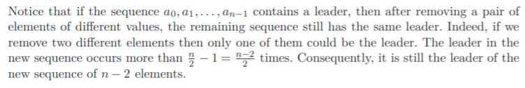
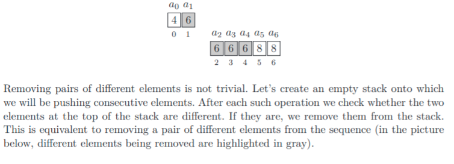
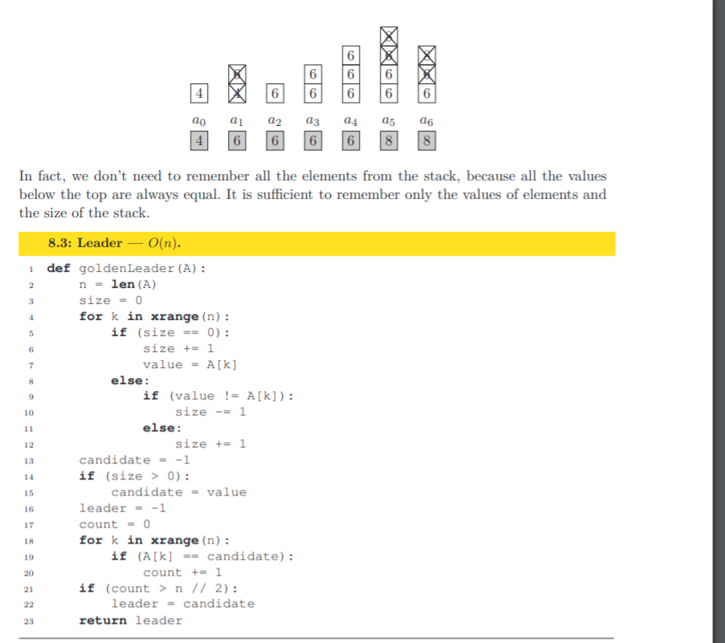

# Leader

Leader in a sequence is something whose value occurs
more than n/2 times

**Example:**

```javascript
[6, 8, 4, 6, 8, 6, 6];

/*
      Total elements = 7
      N/2 = 3
      6 occurs 4 times
      Hence 6 is the leader
    */
```

Then the pdf talks about how to find the leader

1. O(n^2) complexity, this was an unnecessary solution, we can safely ignore this

2. O(nlogn)
   We sort the array and then same numbers will be together. Then we can iterate and see if the count of current number is n/2, it is the leader.

3. O(n)
   Logic:
   - If we remove all the consecutive pairs of different numbers.
   - We still end up with the same leader in the new array
   - Hence at the end, only the leader would remain
     <br />
     
     <br />
     <br />
     
     <br />
     <br />
     

In the above logic, after getting the value from the stack, we again iterate through the array and check
whether this value is really the leader by counting it.

I think the solution that they use is interesting but we can also using a hashmap to keep count. And then iterate over the hashmap. It is also an O(n) solution.
