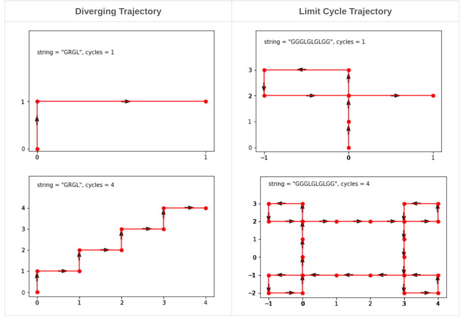
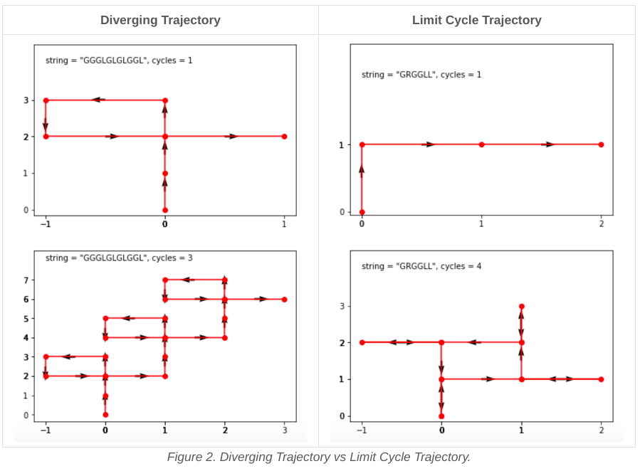
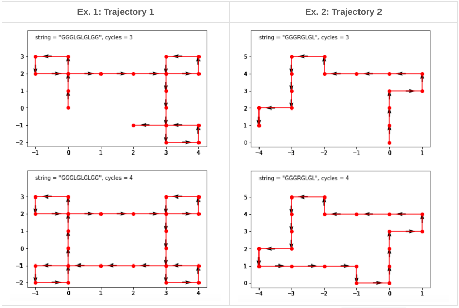
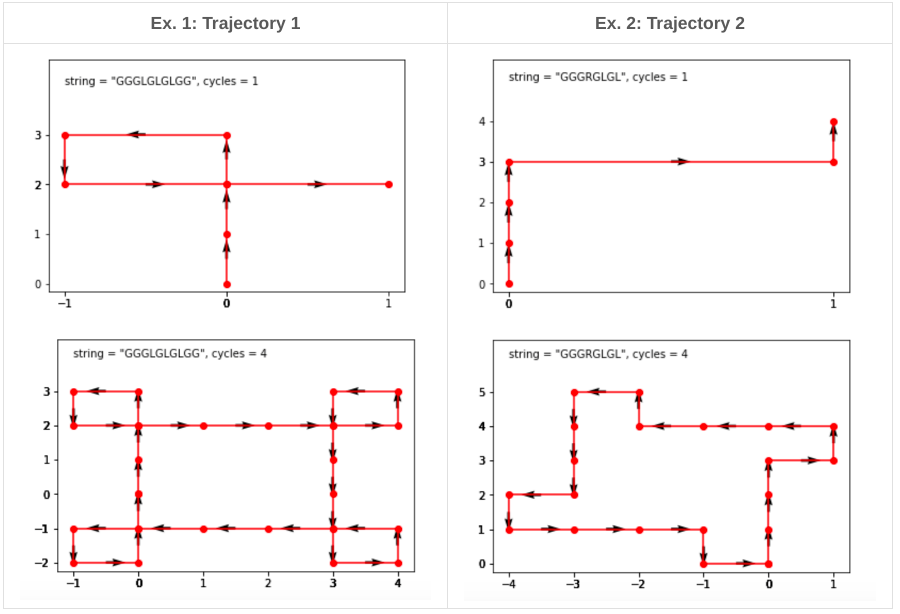

## Solution
---
### Overview
The robot's trajectory attractor is a set of trajectories toward which a system tends to evolve. The question may sound a bit theoretical - is this attractor is limited or not. In other words, if there exists a circle in the plane such that the robot never leaves the circle.

Diverging Trajectory	Limit Cycle Trajectory
bla	bla



<caption> Figure 1. Diverging Trajectory vs Limit Cycle Trajectory. </caption>

Why is it interesting to know? There is a bunch of practical problems related to topology, networks planning, and password brute-forcing. For all these problems, the first thing to understand is do we work within a limited space or the behavior of our system could drastically diverge at some point?

Diverging Trajectory	Limit Cycle Trajectory



<caption> Figure 2. Diverging Trajectory vs Limit Cycle Trajectory. </caption>

## Approach 1: One Pass
Intuition

This solution is based on two facts about the limit cycle trajectory.

After at most 4 cycles, the limit cycle trajectory returns to the initial point x = 0, y = 0. That is related to the fact that 4 directions (north, east, south, west) define the repeated cycles' plane symmetry [proof].



<caption>Figure 3. After 4 cycles the limit cycle trajectory returns to the initial point x = 0, y = 0.</caption>

We do not need to run 4 cycles to identify the limit cycle trajectory. One cycle is enough. There could be two situations here.

First, if the robot returns to the initial point after one cycle, that's the limit cycle trajectory.

Second, if the robot doesn't face north at the end of the first cycle, that's the limit cycle trajectory. Once again, that's the consequence of the plane symmetry for the repeated cycles [proof].



<caption>Figure 4. If at the end of one cycle the robot doesn't face north, that's the limit cycle trajectory.</caption>

<details> 
<summary><h3 style="display:inline;">Algorithm</h3></summary>

Let's use numbers from 0 to 3 to mark the directions: north = 0, east = 1, south = 2, west = 3. In the array directions we could store corresponding coordinates changes, i.e. directions[0] is to go north, directions[1] is to go east, directions[2] is to go south, and directions[3] is to go west.

The initial robot position is in the center x = y = 0, facing north idx = 0.

Now everything is ready to iterate over the instructions.

If the current instruction is R, i.e. to turn on the right, the next direction is idx = (idx + 1) % 4. Modulo here is needed to deal with the situation - facing west, idx = 3, turn to the right to face north, idx = 0.

If the current instruction is L, i.e. to turn on the left, the next direction could written in a symmetric way idx = (idx - 1) % 4. That means we have to deal with negative indices. A more simple way is to notice that 1 turn to the left = 3 turns to the right: idx = (idx + 3) % 4.

If the current instruction is to move, we simply update the coordinates: x += directions[idx][0], y += directions[idx][1].

After one cycle we have everything to decide. It's a limit cycle trajectory if the robot is back to the center: x = y = 0 or if the robot doesn't face north: idx != 0.
</details>
<br />
<details>
  <summary><h3 style="display:inline;">Implementation</h3></summary>
  <pre>
  <code language="java"> 
  class Solution {
    public boolean isRobotBounded(String instructions) {
      // north = 0, east = 1, south = 2, west = 3
      int[][] directions = new int[][]{{0, 1}, {1, 0}, {0, -1}, {-1, 0}};
      // Initial position is in the center
      int x = 0, y = 0;
      // facing north
      int idx = 0;
      
      for (char i : instructions.toCharArray()) {
          if (i == 'L')
              idx = (idx + 3) % 4;
          else if (i == 'R')
              idx = (idx + 1) % 4;
          else {
              x += directions[idx][0];
              y += directions[idx][1];   
          }    
      }
      
      // after one cycle:
      // robot returns into initial position
      // or robot doesn't face north
      return (x == 0 && y == 0) || (idx != 0);
    }
  }
  </code>
  </pre>
</details>

<br />
<br />

### Complexity Analysis
```
Time complexity: O(N), where N is a number of instructions to parse.

Space complexity: O(1) because the array directions contains only 4 elements.
```

<details>
<summary>
<h3 style="display:inline;"> Appendix: Mathematical Proof </h3>
</summary>
Let's provide a strict mathematical proof.

If the robot doesn't face north at the end of the first cycle, then that's the limit cycle trajectory.

First, let's check which direction the robot faces after 4 cycles.

Let's use numbers from 0 to 3 to mark the directions: north = 0, east = 1, south = 2, west = 3. After one cycle the robot is facing direction k != 0.

After 4 cycles, the robot faces direction (k * 4) % 4 = 0, i.e. after 4 cycles, the robot is always facing north.

Second, let's find the robot coordinates after 4 cycles.

The robot initial coordinates are x = y = 0. After one cycle, the new coordinates are x_1 = x+Δx, y_1 = y+Δy, where both Δx and Δy could be positive or negative.

Let's consider four situations.

After one cycle, the robot faces north.
Then here is what we have after 4 cycles:

x_4 = x + Δx + Δx − Δx + Δx = x + 4Δx

y_4 =  y +Δy + Δy + Δy + Δy = y + 4Δy

After one cycle, the robot faces east.
Then here is what we have after 4 cycles:

x_4 = x + Δx + Δy − Δx −Δy = x

y_4 = y + Δy − Δx − Δy +Δx = y

After one cycle, the robot faces south.
Then here is what we have after 4 cycles:

x_4 = x + Δx − Δx + Δ x−Δx = x

y_4 = y + Δy − Δy + Δ y−Δy = y

After one cycle, the robot faces west.
Then here is what we have after 4 cycles:

x_4 = x + Δx − Δy − Δx + Δy = x 

y_4 = y + Δy + Δx − Δy − Δx = y 

Hence, if the robot doesn't face north at the end of the first cycle, then after 4 cycles, the robot is back to the initial coordinates and faces north.

The following statement is a straight consequence.

After at most 4 cycles, the limit cycle trajectory returns to the initial point.

</details>