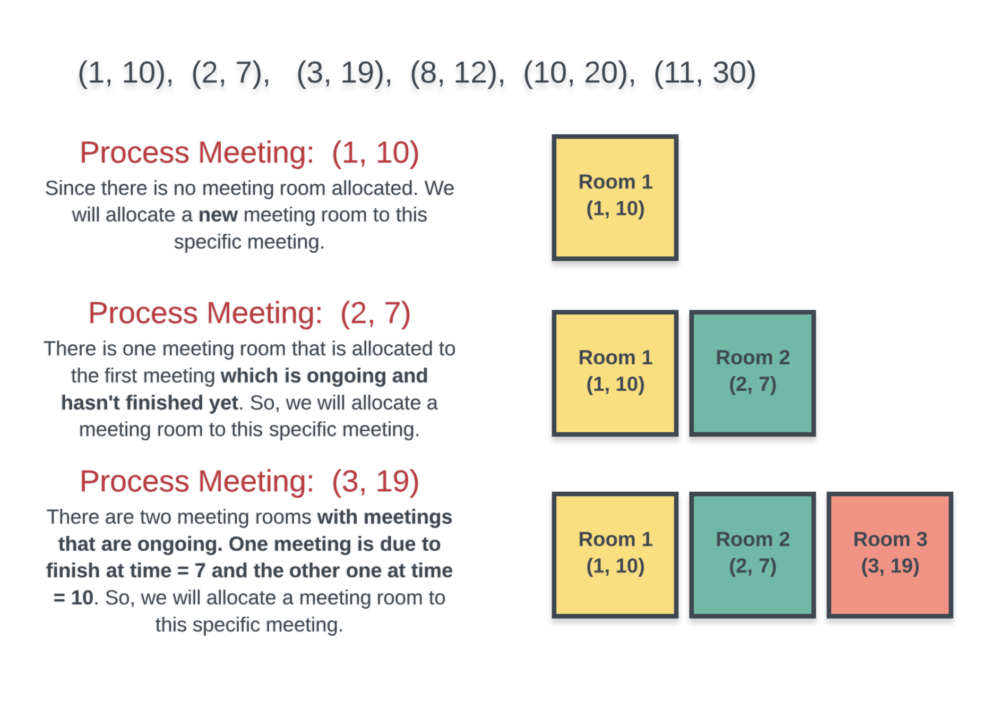
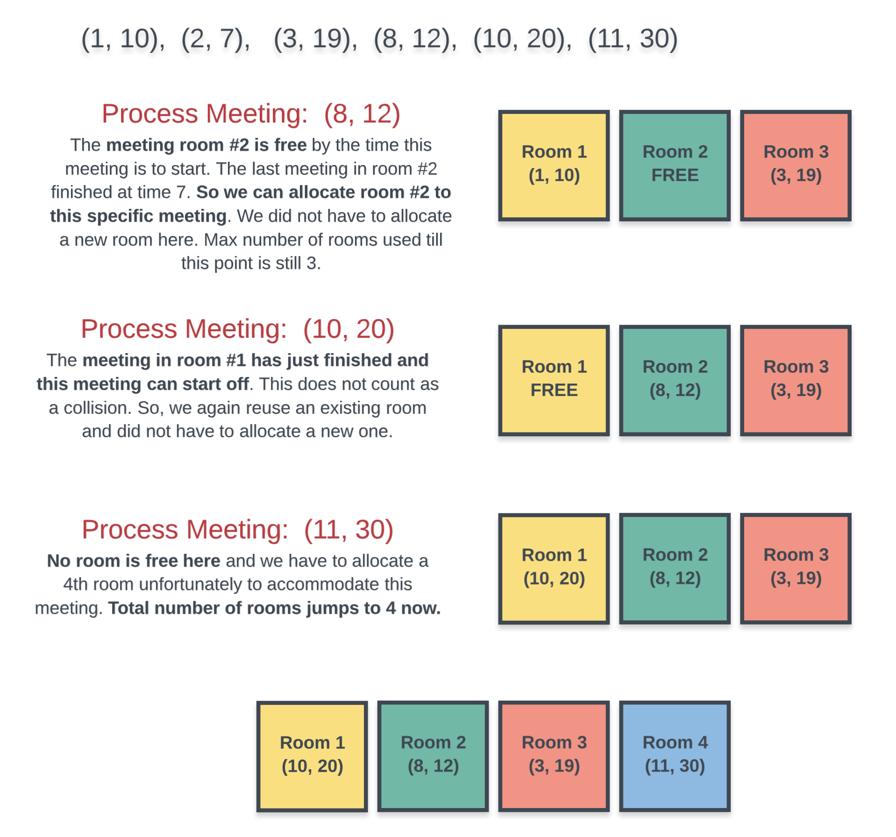

### Intuition

This problem is very similar to something that employees of a company can face potentially on daily basis.

Suppose you work at a company and you belong to the IT department and one of your job responsibilities is securing rooms for meetings that are to happen throughout the day in the office.

You have multiple meeting rooms in the office and you want to make judicious use of them. You don't really want to keep people waiting and want to give a group of employees a room to hold the meeting right on time.

At the same time, you don't really want to use too many rooms unless absolutely necessary. It would make sense to hold meetings in different rooms provided that the meetings are colliding with each other, otherwise you want to make use of as less rooms as possible to hold all of the meetings. How do you go about it ?

I just represented a common scenario at an office where given the start and end times for meetings to happen throughout the day, you, as an IT guru need to setup and allocate the room numbers to different teams.

Let's approach this problem from the perspective of a group of people who want to hold a meeting and have not been allocated a room yet. What would they do?

> This group would essentially go from one room to another and check if any meeting room is free. If they find a room that is indeed free, they would start their meeting in that room. Otherwise, they would wait for a room to be free. As soon as the room frees up, they would occupy it.

This is the basic approach that we will follow in this question. So, it is a kind of simulation but not exactly. In the worst case we can assign a new room to all of the meetings but that is not really optimal right? Unless of course they all collide with each other.

> We need to be able to find out efficiently if a room is available or not for the current meeting and assign a new room only if none of the assigned rooms is currently free.

Let's look at the first approach based on the idea we just discussed.


## Approach 1: Priority Queues
We can't really process the given meetings in any random order. The most basic way of processing the meetings is in increasing order of their start times and this is the order we will follow. After all, it makes sense to allocate a room to the meeting that is scheduled for 9 a.m. in the morning before you worry about the 5 p.m. meeting, right?

Let's do a dry run of an example problem with sample meeting times and see what our algorithm should be able to do efficiently.

We will consider the following meeting times for our example (1, 10), (2, 7), (3, 19), (8, 12), (10, 20), (11, 30). The first part of the tuple is the start time for the meeting and the second value represents the ending time. We are considering the meetings in a sorted order of their start times. The first diagram depicts the first three meetings where each of them requires a new room because of collisions.



The next 3 meetings start to occupy some of the existing rooms. However, the last one requires a new room altogether and overall we have to use 4 different rooms to accommodate all the meetings.



Sorting part is easy, but for every meeting how do we find out efficiently if a room is available or not? At any point in time we have multiple rooms that can be occupied and we don't really care which room is free as long as we find one when required for a new meeting.

A naive way to check if a room is available or not is to iterate on all the rooms and see if one is available when we have a new meeting at hand.

> However, we can do better than this by making use of Priority Queues or the Min-Heap data structure.

Instead of manually iterating on every room that's been allocated and checking if the room is available or not, we can keep all the rooms in a min heap where the key for the min heap would be the ending time of meeting.

So, every time we want to check if any room is free or not, simply check the topmost element of the min heap as that would be the room that would get free the earliest out of all the other rooms currently occupied.

If the room we extracted from the top of the min heap isn't free, then no other room is. So, we can save time here and simply allocate a new room.

Let us look at the algorithm before moving onto the implementation.

Algorithm

Sort the given meetings by their start time.
Initialize a new min-heap and add the first meeting's ending time to the heap. We simply need to keep track of the ending times as that tells us when a meeting room will get free.
For every meeting room check if the minimum element of the heap i.e. the room at the top of the heap is free or not.
If the room is free, then we extract the topmost element and add it back with the ending time of the current meeting we are processing.
If not, then we allocate a new room and add it to the heap.
After processing all the meetings, the size of the heap will tell us the number of rooms allocated. This will be the minimum number of rooms needed to accommodate all the meetings.
Let us not look at the implementation for this algorithm.

```java
  class Solution {
    public int minMeetingRooms(int[][] intervals) {
        
    // Check for the base case. If there are no intervals, return 0
    if (intervals.length == 0) {
      return 0;
    }

    // Min heap
    PriorityQueue<Integer> allocator =
        new PriorityQueue<Integer>(
            intervals.length,
            new Comparator<Integer>() {
              public int compare(Integer a, Integer b) {
                return a - b;
              }
            });

    // Sort the intervals by start time
    Arrays.sort(
        intervals,
        new Comparator<int[]>() {
          public int compare(final int[] a, final int[] b) {
            return a[0] - b[0];
          }
        });

    // Add the first meeting
    allocator.add(intervals[0][1]);

    // Iterate over remaining intervals
    for (int i = 1; i < intervals.length; i++) {

      // If the room due to free up the earliest is free, assign that room to this meeting.
      if (intervals[i][0] >= allocator.peek()) {
        allocator.poll();
      }

      // If a new room is to be assigned, then also we add to the heap,
      // If an old room is allocated, then also we have to add to the heap with updated end time.
      allocator.add(intervals[i][1]);
    }

    // The size of the heap tells us the minimum rooms required for all the meetings.
    return allocator.size();
  }
}

```

Complexity Analysis
```
Time Complexity: O(NlogN).

There are two major portions that take up time here. One is sorting of the array that takes O(NlogN) considering that the array consists of N elements.
Then we have the min-heap. In the worst case, all NN meetings will collide with each other. In any case we have NN add operations on the heap. In the worst case we will have NN extract-min operations as well. Overall complexity being (NlogN) since extract-min operation on a heap takes O(logN).
Space Complexity: O(N) because we construct the min-heap and that can contain N elements in the worst case as described above in the time complexity section. Hence, the space complexity is O(N).

```

***

