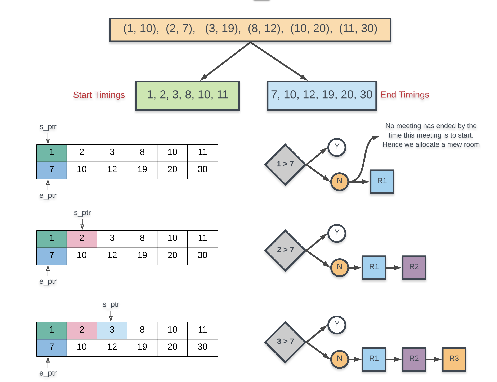
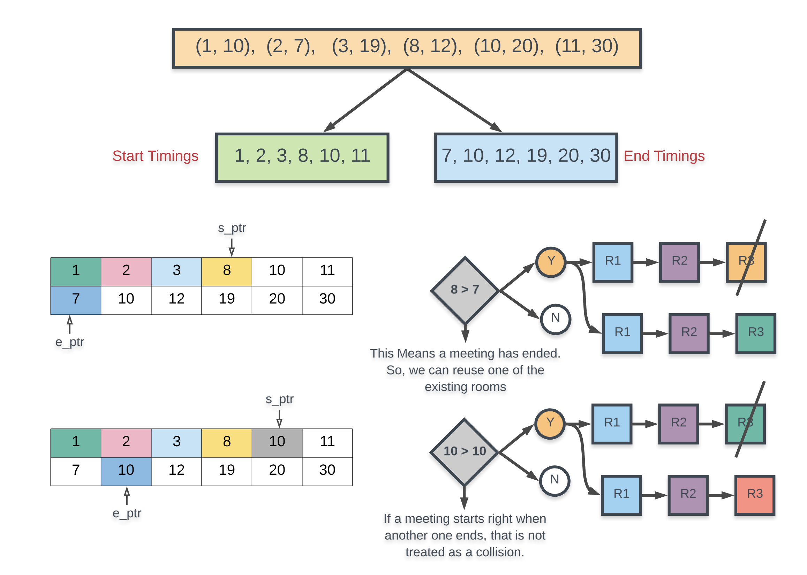

## Approach 2: Chronological Ordering
Intuition

The meeting timings given to us define a chronological order of events throughout the day. We are given the start and end timings for the meetings which can help us define this ordering.

Arranging the meetings according to their start times helps us know the natural order of meetings throughout the day. However, simply knowing when a meeting starts doesn't tell us much about its duration.

We also need the meetings sorted by their ending times because an ending event essentially tells us that there must have been a corresponding starting event and more importantly, an ending event tell us that a previously occupied room has now become free.

A meeting is defined by its start and end times. However, for this specific algorithm, we need to treat the start and end times individually. This might not make sense right away because a meeting is defined by its start and end times. If we separate the two and treat them individually, then the identity of a meeting goes away. This is fine because:

> When we encounter an ending event, that means that some meeting that started earlier has ended now. We are not really concerned with which meeting has ended. All we need is that some meeting ended thus making a room available.

Let us consider the same example as we did in the last approach. We have the following meetings to be scheduled: (1, 10), (2, 7), (3, 19), (8, 12), (10, 20), (11, 30). As before, the first diagram show us that the first three meetings are colliding with each other and they have to be allocated separate rooms.

The next two diagrams process the remaining meetings and we see that we can now reuse some of the existing meeting rooms. The final result is the same, we need 4 different meeting rooms to process all the meetings. That's the best we can do here.

Algorithm

Separate out the start times and the end times in their separate arrays.
Sort the start times and the end times separately. Note that this will mess up the original correspondence of start times and end times. They will be treated individually now.
We consider two pointers: s_ptr and e_ptr which refer to start pointer and end pointer. The start pointer simply iterates over all the meetings and the end pointer helps us track if a meeting has ended and if we can reuse a room.
When considering a specific meeting pointed to by s_ptr, we check if this start timing is greater than the meeting pointed to by e_ptr. If this is the case then that would mean some meeting has ended by the time the meeting at s_ptr had to start. So we can reuse one of the rooms. Otherwise, we have to allocate a new room.
If a meeting has indeed ended i.e. if `start[s_ptr] >= end[e_ptr]`, then we increment e_ptr.
Repeat this process until s_ptr processes all of the meetings.

> This is the solution I have implemented in solution.js

Complexity Analysis

Time Complexity: O(NlogN) because all we are doing is sorting the two arrays for start timings and end timings individually and each of them would contain NN elements considering there are NN intervals.

Space Complexity: O(N) because we create two separate arrays of size N, one for recording the start times and one for the end times.