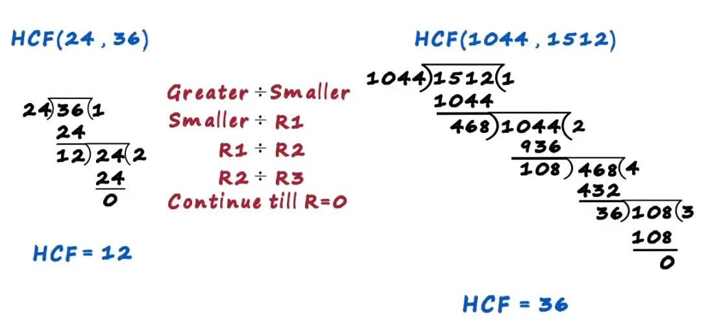

# GCD or HCF
Greatest Divisor or Highest Common Factor

### Meaning?
Example: 8, 12
Let's first find factors of both 8 and 12

`Factors of 8 = 1,2,4,8`
`Factors of 12 = 1,2,3,4,6,12`

All common factors of 8,12 = 1,2,4

`=> H.C.F. = 4`
___

### Prime Factor for finding H.C.F
Example: Find H.C.F of 24,36

`Prime Factors of 24 = 2 * 2 * 2 * 3`

`Prime Factors of 36 = 2 * 2 * 3 * 3`

Answer is to multiple prime factors of both the numbers

`=> H.C.F. = 2 * 2 * 3 = 12`

___

### Continuous Division Method for finding H.C.F of 2 numbers

This is an effecient method for finding HCF of two large numbers. This is what we will use in algorithms.

*How to find HCF*